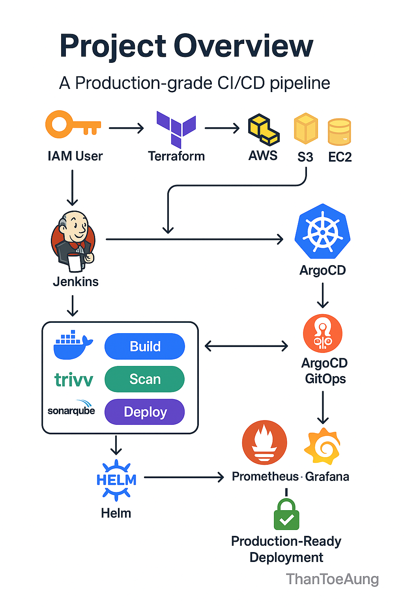

# 🚀 Full-Stack DevOps Project

This project demonstrates a **production-grade CI/CD pipeline** using modern DevOps tools such as Terraform, Jenkins, ArgoCD, Helm, SonarQube, Trivy, Prometheus, and Grafana. It includes infrastructure provisioning, continuous integration, continuous deployment, security scanning, GitOps, and monitoring.

---

## 📌 Project Overview

The following diagram illustrates the complete pipeline:



---

## 🔧 Tools & Technologies Used

| Area                | Tools & Services                          |
|---------------------|-------------------------------------------|
| Infrastructure      | AWS, Terraform, EC2, IAM, S3              |
| CI/CD               | Jenkins, Docker, SonarQube, Trivy         |
| GitOps & Deployment | ArgoCD, Helm                              |
| Monitoring          | Prometheus, Grafana                       |

---

## ⚙️ Workflow Description

1. **Terraform** provisions AWS infrastructure including EC2 instances, S3 buckets, IAM roles, and more.
2. **Jenkins** is used to:
   - Build Docker images
   - Run security scans using **Trivy**
   - Perform code analysis with **SonarQube**
   - Deploy applications using **Helm**
3. **ArgoCD** watches the Git repo for changes and manages Kubernetes deployments via GitOps.
4. **Prometheus & Grafana** provide monitoring and visualization of the deployed services.
5. **Helm** is used to package and manage Kubernetes applications.
6. The pipeline ends in a **production-ready deployment**.

---

## 🧪 How to Run Locally

1. **Clone the Repository**
   ```bash
   git clone https://github.com/ThanToeAung845/Full-Stack-Devops-Project.git
   cd Full-Stack-Devops-Project
   ```

2. **Apply Infrastructure with Terraform**
 ```bash
   cd jenkins-server-terraform
   terraform init
   terraform apply
   ```
3. **Set up Jenkins**
   - Access the Jenkins server (via EC2 or localhost)
   - Configure jobs with provided scripts
   - Ensure Docker, Trivy, and SonarQube are integrated properly

4. **Configure ArgoCD**
   - Deploy ArgoCD to your Kubernetes cluster
   - Connect your Git repository for GitOps
   - Apply Application manifests to auto-sync with your workloads

5. **Deploy with Helm**

6. **Access Grafana Dashboard**
   - Port forward or expose Grafana to access it via browse
   - Import predefined dashboards to monitor application and cluster performance


##  📣 Author
Than Toe Aung
DevOps Enthusiast from Myanmar 🇲🇲
https://github.com/ThanToeAung845


